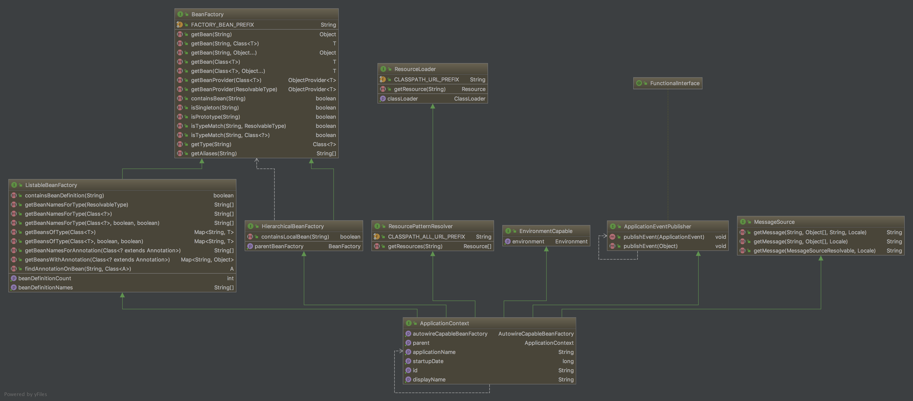
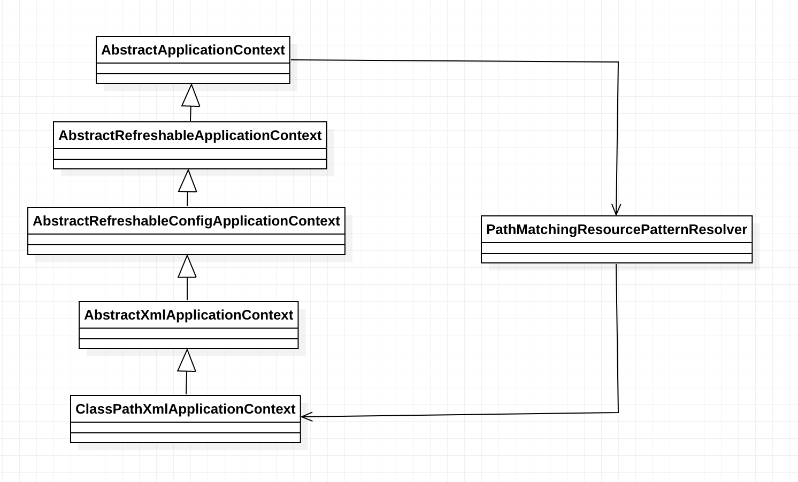
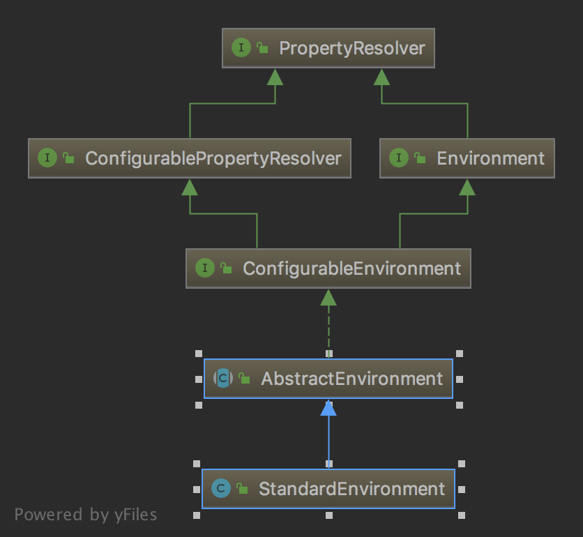
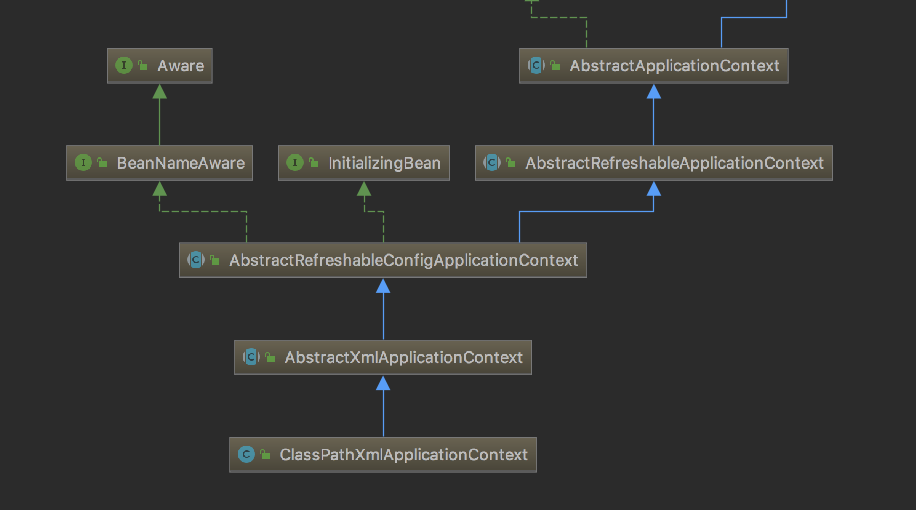

# spring-framework-example
(整理中...)
> 源码学习系列

## 简单示例 Simple
> 本文使用`lombok`为了更简洁的代码
从最简单的方式加载Bean开始分析,

### 创建个`Animal.java`类

代码如下:
```java
@Data
public class Animal {
    private String name;
    private String category;
    private String color;
}
```

### 创建 `Simple.java` 类
代码如下:
```java
public static void main(String[] args) {
        ApplicationContext context = new ClassPathXmlApplicationContext("Simple.xml");
        Animal animal = (Animal) context.getBean("animal");
        System.out.println(animal);
}
```

### 创建 `Simple.xml`

主要代码如下:
```xml
<bean name="animal" class="com.x.sp.example.spring.entity.Animal">
    <property name="name" value="小黄"/>
    <property name="category" value="狗"/>
    <property name="color" value="黄色"/>
</bean>
```

### 运行结果

控制台输出:

```text
Animal(name=小黄, category=狗, color=黄色)
```

### 分析

> 这里不说概念,网上一大堆,只分析过程

围绕这几个问题,我们逐一分析

 - 到底`spring`再后面处理什么?
 - `xml`的信息加载到什么地方
 - `bean`到底存在哪里?
 - `ApplicationContext`是怎么获取`xml`中`bean`的定义?

#### `ApplicationContext` 分析


> `application` 通常翻译应用程序,百度翻译如下:n.
                    适用，应用，运用;申请，请求，申请表格;勤勉，用功;敷用，敷用药

> `context` n.
            语境;上下文;背景;环境
           
解释就是`应用程序上下文`,它是`spring`中常用到一个核心类

##### 方法分析

   - `getId()` : 返回此`应用程序上下文`的唯一ID。
   - `getApplicationName()` : 返回此上下文所属的已部署应用程序的名称。
   - `getDisplayName()` : 返回此上下文的友好名称。
   - `getStartupDate()` : 返回首次加载此上下文时的时间戳。
   - `getParent()` : 返回父上下文，如果没有父上下文，并且这是上下文层次结构的根，则返回空。
   - `getAutowireCapableBeanFactory()` : 为此上下文公开AutoWireCapableBeanFactory功能。
   
> `getAutowireCapableBeanFactory()`这通常不被应用程序代码使用，除非是为了初始化不在应用程序上下文中的bean实例，将SpringBean生命周期（全部或部分）应用于它们。
          
##### 继承分析
`ApplicationContext`是一个接口,它继承如下:
 - EnvironmentCapable
 - ListableBeanFactory
 - HierarchicalBeanFactory
 - MessageSource
 - ApplicationEventPublisher
 - ResourcePatternResolver
 
 有点多...,我们逐一分析每个类的用处
 
###### EnvironmentCapable

> `Environment` n.环境，外界;周围，围绕;工作平台;（运行）环境
            
> `Capable` adj.能干的;有才能的;有才华的;能胜任的
           
叫他`环境能力`比较奇怪,这里叫`提供环境`吧

 -  `getEnvironment()` : 返回与此组件关联的环境

里面只有一个`getEnvironment()`获取环境的方法,顾名思义它的作用就是提供环境变量的


###### ListableBeanFactory

> `Listable` 列表, adj. 能列在单子上的

按名称来解释就是,可列出`Bean`的工厂,提供容器中bean迭代的功能,不再需要一个个bean地查找.如下:

- `containsBeanDefinition()` : 检查此bean工厂是否包含具有给定名称的bean定义
- `getBeanDefinitionCount()` : 返回工厂中定义的bean数目。
- `getBeanDefinitionNames()` : 返回此工厂中定义的所有bean的名称。
- `getBeanNamesForType(ResolvableType)` : 根据bean定义或`ResolvableType.getObjectType`的值，返回与给定类型（包括子类）匹配的bean的名称。
- `getBeanNamesForType(Class)` : 返回与给定类型（包括子类）匹配的bean名称，根据bean定义或`factorybeans`中`getObjectType`的值进行判断
- `getBeanNamesForType(Class,includeNonSingletons:boolean , allowEagerInit:boolean )` 

   - `includeNonSingletons` : 是否也包括原型或作用域bean，或者只包括单例bean（也适用于`Factorybean`）
   - `allowEagerInit` : 
   
是否初始化`FactoryBeans`（或通过带有“factory bean”引用的工厂方法）创建的lazy init单例和对象进行类型检查。请注意，`FactoryBeans`需要预先初始化以确定其类型：因此请注意，为此标志传入“true”将初始化factorybeans和“factory bean”引用。
- `getBeansOfType(Class)`有类似3个方法,这里不一一解释了 : 返回与给定对象类型（包括子类）匹配的bean实例，根据bean定义或`FactoryBeans`的`getObjectType`值判断
- `getBeanNamesForAnnotation()` 通过注解获取BeanName集
- `getBeansWithAnnotation()` 和`getBeanByType`差不多,这个方法是通过`注解@`
- `findAnnotationOnBean()` 通过BeanName和注解获取,大同小异

小结一下`ListableBeanFactory`提供了如下方法:

- 通过`BeanName`判断是否定义了
- 统计已定义`Bean`的个数
- 获取已定义的`Bean`集合
- 可通过`Type`获取`BeanNames`,`Bean`集合(记住是`Map`)
- 也可通过`@Annotation`获取`BeanNames`,`Bean`集合


`ListableBeanFactory` 继承 `BeanFactory` 接口,下面来分析一下主要方法:

- `getBean()` : 返回指定bean的实例，该实例可以是共享的，也可以是独立的。

    - `getBean` 有多种获取方法,这里不一一列举
    
- `getBeanProvider()` : 返回指定bean的提供程序，允许延迟按需检索(TODO 直接翻译的,以后再弄明白)
- `isSingleton()` : 是否单例 - 这是单例共享的bean吗？也就是说，将始终返回相同的实例？
- `isPrototype()` : 是否原型 - 这个bean是原型吗？也就是说，总是返回独立的实例吗？
- `isTypeMatch(String,ResolvableType)` : 检查具有给定名称的bean是否与指定类型匹配。
- `isTypeMatch(String,Class)` : 同上
- `getType(String)` : 这类型的确定与给定名称的bean。更具体来说，确定的类型的对象，将返回给定的名称
- `getAliases(String)` : 返回给定bean名称的别名（如果有）。

`Simple`代码中,`getBean('animal')`就是调用该接口,具体实现后面会具体分析

###### HierarchicalBeanFactory

> `Hierarchical` adj.分层的;按等级划分的，等级（制度）的

跟`ListableBeanFactory`对比,这个接口具有层级关系的`BeanFactory`,同样它也是继承`BeanFactory`,
这里可以猜到`spring`的命名规则,只要继承`BeanFactory`接口,都叫`XxxxBeanFactory`

`HierarchicalBeanFactory`只有两个方法

- `getParentBeanFactory()` : 返回父bean工厂，如果没有则返回null。
- `containsLocalBean(String)` : 返回本地bean工厂是否包含给定名称的bean，忽略祖先上下文中定义的bean。

###### MessageSource

用于解析消息的策略接口，支持此类消息的参数化和国际化

- `getMessage()` 多参数获取消息,一般用于获取已定义的消息(国际化),尝试解决此消息。如果找不到消息，则返回默认消息。

###### ApplicationEventPublisher

- `publishEvent(ApplicationEvent)` : 将应用程序事件通知所有与此应用程序注册的匹配侦听器。事件可以是框架事件（如RequestHandledEvent）或特定于应用程序的事件。

`ApplicationEvent`最终也会转成`Object`,看下面代码

```java
    default void publishEvent(ApplicationEvent event) {
		publishEvent((Object) event);
	}
```

这里注意的是`ApplicationEventPublisher`有个`@FunctionalInterface`注解,该注解解释如下


```text
1、该注解只能标记在”有且仅有一个抽象方法”的接口上。 
2、JDK8接口中的静态方法和默认方法，都不算是抽象方法。 
3、接口默认继承java.lang.Object，所以如果接口显示声明覆盖了Object中方法，那么也不算抽象方法。 
4、该注解不是必须的，如果一个接口符合”函数式接口”定义，那么加不加该注解都没有影响。加上该注解能够更好地让编译器进行检查。如果编写的不是函数式接口，但是加上了@FunctionInterface，那么编译器会报错。
```

(这里暂时不详细说明该接口,往后分析中会结合到一起解说)


###### ResourcePatternResolver

> `Resource` n.	资源; 物力，财力; 办法; 智谋;

> `Pattern` n.	模式; 图案; 花样，样品; 榜样，典范;

> `Resolver` n.	下决心者，解决[答]问题者; 溶媒; 求解仪;

感觉叫他`资源模式分析器`比较好听

源码注释翻译如下:用于将位置模式（例如，Ant样式的路径模式）解析为资源对象的策略接口。

该接口只有一个方法

- `getResources(String): Resource[]`将给定的位置模式解析为资源对象。返回可能是多个`Resource`

该接口继承`ResourceLoader`,方法如下

- `getResources()` 跟`ResourcePatternResolver`不同,它只返回单个`Resource`
- `getClassLoader():ClassLoader` : 公开此资源加载器使用的类加载器

> 好吧,看了那么多接口和方法,后面开始分析具体实现

ApplicationContext依赖如下:



#### 具体实现 `ClassPathXmlApplicationContext`

`ClassPathXmlApplicationContext`提供了多个构造方法,先列出所有参数

- `String[] configLocations` 多个路径,可以说是多个`xml`的路径
- `ApplicationContext parent` 父`ApplicationContext`
- `boolean refresh` 是否刷新,默认`true`
- `String[] paths` 类路径中的相对（或绝对）路径
- `Class` 用于加载资源的类（给定路径的基础）

我们目前只看`Simple`中的构造方法,其它先不管,当`new`的时候,它会一直往父类调用构造方法`super(parent)`
我们这里`parent`肯定是空的,可以看看我画的图,到底往上调了多少层



到最后`AbstractApplicationContext`他会调用自己`this()`构造方法,`AbstractApplicationContext`抽象类中,一个字段

```java
    private ResourcePatternResolver resourcePatternResolver;
```

`this()`构造方法会调用`getResourcePatternResolver()`来填充该字段

```java
    protected ResourcePatternResolver getResourcePatternResolver() {
		return new PathMatchingResourcePatternResolver(this);
	}
```

`getResourcePatternResolver()`会返回一个`new PathMatchingResourcePatternResolver(this)`实例,相当于

```
new PathMatchingResourcePatternResolver(new ClassPathXmlApplicationContext());
```

继续往下走是`setConfigLocations(configLocations);`

```java
    public void setConfigLocations(@Nullable String... locations) {
		if (locations != null) {
			Assert.noNullElements(locations, "Config locations must not be null");
			this.configLocations = new String[locations.length];
			for (int i = 0; i < locations.length; i++) {
				this.configLocations[i] = resolvePath(locations[i]).trim();
			}
		}
		else {
			this.configLocations = null;
		}
	}
```

这个也比较绕,我按顺序列一下

- 调用的父类的`AbstractRefreshableConfigApplicationContext.setConfigLocations`,`ClassPathXmlApplicationContext`自己并没有重写这个方法
- 首先遍历传入的`locations`(也就是`Simple.xml`)
- 调用`resolvePath(String)`处理文件路径
- `resolvePath(String)`会获取提供的环境`environment`
- 如果`environment`为空,会创建一个`StandardEnvironment`实例
- 因为`StandardEnvironment`继承`AbstractEnvironment`,创建是会调用`AbstractEnvironment`构造方法
- `AbstractEnvironment`会调用自己的`customizePropertySources`方法
- 由于`StandardEnvironment`重写了`customizePropertySources`
- 所以会执行`StandardEnvironment.customizePropertySources()`
- `customizePropertySources`将会加载`systemEnvironment,systemProperties`系统变量和系统配置
- `environment`初始化完成之后将会调用`AbstractEnvironment.resolveRequiredPlaceholders(path)`
- 接着将会调用`AbstractEnvironment.propertyResolver`
    
    - `AbstractEnvironment.propertyResolver`默认初始化实例就是`PropertySourcesPropertyResolver`
    - 这里要看清楚`PropertySourcesPropertyResolver`是继承`AbstractPropertyResolver`
    - 所以等于调用`AbstractPropertyResolver.resolveRequiredPlaceholders(String)`这个方法

```
	@Override
	public String resolveRequiredPlaceholders(String text) throws IllegalArgumentException {
		if (this.strictHelper == null) {
			this.strictHelper = createPlaceholderHelper(false);
		}
		return doResolvePlaceholders(text, this.strictHelper);
	}
```

- `resolveRequiredPlaceholders` 这个方法里面还会初始化一个叫`strictHelper`
- `strictHelper`为空将会实例`PropertyPlaceholderHelper`,用来处理`property`的占位符的,如`[]${}()`,和一定的规则
- 我们传入的值`Simple.xml`并没有使用任何占位符,所以直接返回`Simple.xml`
- 最后将会把`locations` 赋予`AbstractRefreshableConfigApplicationContext.configLocations`字段
- (暂时未知`StandardEnvironment`获取系统变量和配置做什么,这里先跳过不管)

最后看看`StandardEnvironment`的依赖图




再往下是`refresh`,默认是true

实际调用的是`AbstractApplicationContext.refresh()`

因为`ClassPathXmlApplicationContext`间接继承了`AbstractApplicationContext`如下图



```java
    // 去掉了日志的输出
	public void refresh() throws BeansException, IllegalStateException {
		synchronized (this.startupShutdownMonitor) {
		    // 准备上下文刷新
			//Prepare this context for refreshing.
			prepareRefresh();

            // 告诉子类刷新内部bean工厂。
            // 1. 如果存在beanFactory,则清空,重新创建
			// Tell the subclass to refresh the internal bean factory.
			ConfigurableListableBeanFactory beanFactory = obtainFreshBeanFactory();

			// Prepare the bean factory for use in this context.
			prepareBeanFactory(beanFactory);

			try {
				// Allows post-processing of the bean factory in context subclasses.
				postProcessBeanFactory(beanFactory);

				// Invoke factory processors registered as beans in the context.
				invokeBeanFactoryPostProcessors(beanFactory);

				// Register bean processors that intercept bean creation.
				registerBeanPostProcessors(beanFactory);

				// Initialize message source for this context.
				initMessageSource();

				// Initialize event multicaster for this context.
				initApplicationEventMulticaster();

				// Initialize other special beans in specific context subclasses.
				onRefresh();

				// Check for listener beans and register them.
				registerListeners();

				// Instantiate all remaining (non-lazy-init) singletons.
				finishBeanFactoryInitialization(beanFactory);

				// Last step: publish corresponding event.
				finishRefresh();
			}

			catch (BeansException ex) {
				// Destroy already created singletons to avoid dangling resources.
				destroyBeans();

				// Reset 'active' flag.
				cancelRefresh(ex);

				// Propagate exception to caller.
				throw ex;
			}

			finally {
				// Reset common introspection caches in Spring's core, since we
				// might not ever need metadata for singleton beans anymore...
				resetCommonCaches();
			}
		}
	}
```

吐血分析又要开始,读`spring`源码唯有死磕

1. 首先看看`prepareRefresh()`做了什么

```
    // 这里去掉了日志输出部分代码
    protected void prepareRefresh() {
        // 1. 设置 startupDate 时间为当前
		this.startupDate = System.currentTimeMillis();
		// 2. 标记此上下文是否已关闭的。
		this.closed.set(false);
		// 3. 标记此上下文当前是否处于活动状态。
		this.active.set(true);

		// 4. 在上下文环境中初始化任何占位符属性源
		initPropertySources();

        // 5. 验证所有标记为“必需”的属性是否可解析
        // (实质上就看看environment的key值是否为空...)
		getEnvironment().validateRequiredProperties();

        // 6. 早期发布的ApplicationEvents,清空?
		this.earlyApplicationEvents = new LinkedHashSet<>();
	}
```

2. 下面来看

```java
// 获取一个新的`BeanFactory`
ConfigurableListableBeanFactory beanFactory = obtainFreshBeanFactory();
```

调用的是`AbstractApplicationContext.obtainFreshBeanFactory()`

```java
    protected ConfigurableListableBeanFactory obtainFreshBeanFactory() {
		refreshBeanFactory();
		return getBeanFactory();
	}
```

`refreshBeanFactory()`调用的是`AbstractRefreshableApplicationContext.refreshBeanFactory()`

```java

    protected final void refreshBeanFactory() throws BeansException {
        // 如果存在beanFactory会销毁并且关闭
		if (hasBeanFactory()) {
		    //TODO 这销毁的方法,后面再详看
			destroyBeans();
			closeBeanFactory();
		}
		try {
		    // 新建 DefaultListableBeanFactory,本例子中没有parent,所以直接创建
			DefaultListableBeanFactory beanFactory = createBeanFactory();
			// 设置一个UUID
			beanFactory.setSerializationId(getId());
			// 定制beanFactory
			// allowBeanDefinitionOverriding:是否设置该factory优先级, 默认为 null 跳过
			// allowCircularReferences: 是否设置该factory可以循环引用, 默认为 null 跳过
			customizeBeanFactory(beanFactory);
			// 读取Bean定义(看后面的代码段)
			loadBeanDefinitions(beanFactory);
			synchronized (this.beanFactoryMonitor) {
				this.beanFactory = beanFactory;
			}
		}
		catch (IOException ex) {
			throw new ApplicationContextException("I/O error parsing bean definition source for " + getDisplayName(), ex);
		}
	}

```

更加深入的分析上面代码段中的`loadBeanDefinitions`

首先调用的是 `AbstractXmlApplicationContext.loadBeanDefinitions()`(因为是继承关系)
 
```java
@Override
	protected void loadBeanDefinitions(DefaultListableBeanFactory beanFactory) throws BeansException, IOException {
        
		// 1. 为给定BeanFactory创建新的xmlBeanDefinitionReader
		// 这个reader设置了BeanFactory至关重要,因为将bean添加到缓存中需要用到
		XmlBeanDefinitionReader beanDefinitionReader = new XmlBeanDefinitionReader(beanFactory);

		// 2. 设置该xmlBeanDefinitionReader的环境变量
		beanDefinitionReader.setEnvironment(this.getEnvironment());
		
		// 3. 设置 beanDefinitionReader.setResourceLoader(this):this = ClassPathXmlApplicationContext
		beanDefinitionReader.setResourceLoader(this);
		
		// 4. 设置 beanDefinitionReader.setEntityResolver(new ResourceEntityResolver(this))
        //    4.1) ResourceEntityResolver 资源实体解释器
        //    4.2) this = ClassPathXmlApplicationContext
		beanDefinitionReader.setEntityResolver(new ResourceEntityResolver(this));

		// 5. 初始化 initBeanDefinitionReader
        //    5.1) 里面只执行了 reader.setValidating(this.validating); 是否开启验证,默认为true
		initBeanDefinitionReader(beanDefinitionReader);
		
		// 6. loadBeanDefinitions(beanDefinitionReader)
		//    6.1) 方法名意思:读取bean的定义
		//    6.2) 并且把beanDefinitionReader传入
		//    6.3) 具体实现就是调用beanDefinitionReand的loadBeanDefinitions
		//    6.4) 先获取configResources,如果不为空,开始读取bean定义 -- 这里为空
		//    6.5) 然后获取configLocations,就是例子中传入"Simple.xml"
		//    6.6) 最终会调用传入的"beanDefinitionReader.loadBeanDefinitions()"
		loadBeanDefinitions(beanDefinitionReader);
	}
```

- 首先判断`configResources`和`configLocations`是否存在
- 跟着调用`AbstractBeanDefinitionReader.loadBeanDefinitions(configResources/configLocations)`
- 会看到代码不停调用`loadBeanDefinitions`的各种重载方法,这个过程再不断的解析传入的配置文件
- 接着调用`XmlBeanDefinitionReader.doLoadBeanDefinitions()`
- 接着调用`XmlBeanDefinitionReader.registerBeanDefinitions()`

```java
    public int registerBeanDefinitions(Document doc, Resource resource) throws BeanDefinitionStoreException {
        // 创建 DefaultBeanDefinitionDocumentReader
		BeanDefinitionDocumentReader documentReader = createBeanDefinitionDocumentReader();
		// 获取已定义的bean统计
		int countBefore = getRegistry().getBeanDefinitionCount();
		// 新建一个XmlReaderContext,重头戏再这个registerBeanDefinitions()
		documentReader.registerBeanDefinitions(doc, createReaderContext(resource));
		return getRegistry().getBeanDefinitionCount() - countBefore;
	}
```

- `registerBeanDefinitions()`会执行父类的`DefaultBeanDefinitionDocumentReader.registerBeanDefinitions()`
- 传入`readContext(XmlReadContext)` 后最终执行 `doRegisterBeanDefinitions`看下面代码

```java
    protected void doRegisterBeanDefinitions(Element root) {
        // 创建bean定义解释器的代理
		BeanDefinitionParserDelegate parent = this.delegate;
		// 创建代理时初始化ReaderContext(XmlReadContext)
		// root和parent都为null
		this.delegate = createDelegate(getReaderContext(), root, parent);
		// 是否默认命名空间(以下都是解释xml结构的代码)
		if (this.delegate.isDefaultNamespace(root)) {
			// 略...
		}

        // 预处理(其实什么也没做)
		preProcessXml(root);
		// 解释(xml)bean定义,直到找到<bean>这个xml标签
		// 会调用 <1> processBeanDefinition(ele, delegate) 这个方法
		parseBeanDefinitions(root, this.delegate);
		//
		postProcessXml(root);

		this.delegate = parent;
	}
```

- <1> `processBeanDefinition` 详细代码如下

```java
protected void processBeanDefinition(Element ele, BeanDefinitionParserDelegate delegate) {
        // <1.1> 创建 BeanDefinitionHolder
		BeanDefinitionHolder bdHolder = delegate.parseBeanDefinitionElement(ele);
		if (bdHolder != null) {
		    // 对标签下的自定义标签，再次解析(解释代码我不分析,无非就是对XML深度解释)
			bdHolder = delegate.decorateBeanDefinitionIfRequired(ele, bdHolder);
			
			// 这里传入的是BeanDefinitionHolder和 <1.2> getReaderContext().getRegistry() = DefaultListableBeanFactory
			// <1.3> 真正注册Bean到内存的方法(饶了好大好大的一圈...)
			BeanDefinitionReaderUtils.registerBeanDefinition(bdHolder, getReaderContext().getRegistry());
			// 发送注册事件
			// <1.4>实例 BeanComponentDefinition(bdHolder)
			getReaderContext().fireComponentRegistered(new BeanComponentDefinition(bdHolder));
		}
	}
```

- <1.1> 创建 BeanDefinitionHolder

```java
    public BeanDefinitionHolder parseBeanDefinitionElement(Element ele, @Nullable BeanDefinition containingBean) {
        // 获取id(这里为null)
		String id = ele.getAttribute(ID_ATTRIBUTE);
		// 获取name(这里为animal)
		String nameAttr = ele.getAttribute(NAME_ATTRIBUTE);

		List<String> aliases = new ArrayList<>();
		if (StringUtils.hasLength(nameAttr)) {
		    // 把名称按 ",;" 分割成数组
			String[] nameArr = StringUtils.tokenizeToStringArray(nameAttr, MULTI_VALUE_ATTRIBUTE_DELIMITERS);
			// 添加到别名aliases集合
			aliases.addAll(Arrays.asList(nameArr));
		}

		String beanName = id;
		// beanName = aliases[0]
		if (!StringUtils.hasText(beanName) && !aliases.isEmpty()) {
			beanName = aliases.remove(0);
			if (logger.isTraceEnabled()) {
				logger.trace("No XML 'id' specified - using '" + beanName +
						"' as bean name and " + aliases + " as aliases");
			}
		}
        // 检查是否唯一
		if (containingBean == null) {
			checkNameUniqueness(beanName, aliases, ele);
		}
        
        // <1.1.1> 创建 AbstractBeanDefinition(实例是GenericBeanDefinition)
		AbstractBeanDefinition beanDefinition = parseBeanDefinitionElement(ele, beanName, containingBean);
		if (beanDefinition != null) {
			if (!StringUtils.hasText(beanName)) {
				// ...这里省略了,主要逻辑是没有beanName,去生成一个beanName(个人觉得并不是很重要)
			}
			String[] aliasesArray = StringUtils.toStringArray(aliases);
			// 最后通过多参数方式新建一个BeanDefinitionHolder
			return new BeanDefinitionHolder(beanDefinition, beanName, aliasesArray);
		}

		return null;
	}
```

- <1.1.1> 创建 AbstractBeanDefinition(实例是GenericBeanDefinition)

```java
	public AbstractBeanDefinition parseBeanDefinitionElement(
			Element ele, String beanName, @Nullable BeanDefinition containingBean) {

        //放入解释状态的`LinkedList<Entry> state`中 
        //官方解释: 简单的linkedlist结构，用于在分析过程中跟踪逻辑位置。@link entry entries在解析阶段的每个点以特定于读卡器的方式添加到LinkedList。
		this.parseState.push(new BeanEntry(beanName));

        // 解释xml中的className,这里为`Simple.xml`的 `class="com.x.sp.example.spring.entity.Animal"`
		String className = null;
		if (ele.hasAttribute(CLASS_ATTRIBUTE)) {
			className = ele.getAttribute(CLASS_ATTRIBUTE).trim();
		}
		// 是否parent的xml标签(`Simple.xml`中没有)
		String parent = null;
		if (ele.hasAttribute(PARENT_ATTRIBUTE)) {
			parent = ele.getAttribute(PARENT_ATTRIBUTE);
		}

		try {
		    // 实现是调用BeanDefinitionReaderUtils.createBeanDefinition工具类
		    // 新建 GenericBeanDefinition的实例
			AbstractBeanDefinition bd = createBeanDefinition(className, parent);

			// (...省略) 处理各种xml标签
            // 返回
			return bd;
		}//..省略异常
		finally {
		    // 从处理状态中弹出
			this.parseState.pop();
		}
		return null;
	}
```

- <1.2> `getReaderContext().getRegistry()` = `DefaultListableBeanFactory`

    - 因为`DefaultListableBeanFactory`实现`BeanDefinitionRegistry`接口
    - `getReaderContext().getRegistry()`就是获取`BeanDefinitionRegistry`实例

- <1.3> `BeanDefinitionReaderUtils.registerBeanDefinition(bdHolder, getReaderContext().getRegistry());`

```java
    public static void registerBeanDefinition(BeanDefinitionHolder definitionHolder, BeanDefinitionRegistry registry) {
        // 获取beanName
		String beanName = definitionHolder.getBeanName();
		// <1.3.1>调用 DefaultListableBeanFactory.registerBeanDefinition
		registry.registerBeanDefinition(beanName, definitionHolder.getBeanDefinition());

		// Register aliases for bean name, if any.
		String[] aliases = definitionHolder.getAliases();
		if (aliases != null) {
			for (String alias : aliases) {
				registry.registerAlias(beanName, alias);
			}
		}
	}
```

- <1.3.1>调用 `DefaultListableBeanFactory.registerBeanDefinition`

```java
    // ( 代码经过删减,先分析主要部分)
    public void registerBeanDefinition(String beanName, BeanDefinition beanDefinition){
		if (beanDefinition instanceof AbstractBeanDefinition) {
		    //校验该bean是否有方法重载(会抛出异常->无法将静态工厂方法与方法重写组合：静态工厂方法必须创建实例)
			((AbstractBeanDefinition) beanDefinition).validate();
		}
        // 从定义中获取已定义bean(因为我们是刷新,这里肯定为空,TODO 后面关注什么时候会不为null)
		BeanDefinition existingDefinition = this.beanDefinitionMap.get(beanName);
		if (existingDefinition != null) {
			// (...略) 暂时略过
		} else {
		    // 检查这个工厂的bean创建阶段是否已经开始，即是否同时将任何bean标记为已创建。
			if (hasBeanCreationStarted()) {
				// 无法再修改启动时间集合元素（用于稳定迭代）
				// (下面代码暂时跳过分析)
				synchronized (this.beanDefinitionMap) {
					this.beanDefinitionMap.put(beanName, beanDefinition);
					List<String> updatedDefinitions = new ArrayList<>(this.beanDefinitionNames.size() + 1);
					updatedDefinitions.addAll(this.beanDefinitionNames);
					updatedDefinitions.add(beanName);
					this.beanDefinitionNames = updatedDefinitions;
					if (this.manualSingletonNames.contains(beanName)) {
						Set<String> updatedSingletons = new LinkedHashSet<>(this.manualSingletonNames);
						updatedSingletons.remove(beanName);
						this.manualSingletonNames = updatedSingletons;
					}
				}
			}
			else {
				// 放入定义BeanMap中(spring的bean容器应该就是放在这个Map了)
				this.beanDefinitionMap.put(beanName, beanDefinition);
				// 放入定义BeanNameMap中(名字集合)
				this.beanDefinitionNames.add(beanName);
				// TODO 这里为什么要删掉
				this.manualSingletonNames.remove(beanName);
			}
			// 清空,暂时不关注,字面意思冻结bean定义名称
			this.frozenBeanDefinitionNames = null;
		}
        
        // 检查是否存在定义 || 包含单例
		if (existingDefinition != null || containsSingleton(beanName)) {
		    // 重置给定bean的所有bean定义缓存，包括从中派生的bean的缓存。
		    // 本次调试并未进入该方法(跳过)
			resetBeanDefinition(beanName);
		}
	}
```
- <1.4> 实例化`BeanComponentDefinition`

```java
    public BeanComponentDefinition(BeanDefinitionHolder beanDefinitionHolder) {
		super(beanDefinitionHolder);
        // 读取内部的bean
		List<BeanDefinition> innerBeans = new ArrayList<>();
		// 读取引用的bean
		List<BeanReference> references = new ArrayList<>();
		PropertyValues propertyValues = beanDefinitionHolder.getBeanDefinition().getPropertyValues();
		// 下面逻辑将是读取内部 or 引用的 bean(Simple.xml定义了是一些字段的属性)
		for (PropertyValue propertyValue : propertyValues.getPropertyValues()) {
			Object value = propertyValue.getValue();
			if (value instanceof BeanDefinitionHolder) {
				innerBeans.add(((BeanDefinitionHolder) value).getBeanDefinition());
			}
			else if (value instanceof BeanDefinition) {
				innerBeans.add((BeanDefinition) value);
			}
			else if (value instanceof BeanReference) {
				references.add((BeanReference) value);
			}
		}
		this.innerBeanDefinitions = innerBeans.toArray(new BeanDefinition[0]);
		this.beanReferences = references.toArray(new BeanReference[0]);
	}
```

(未完待续)